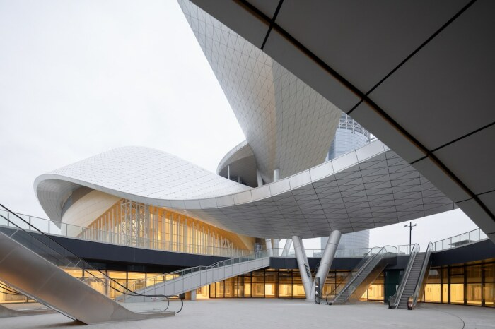
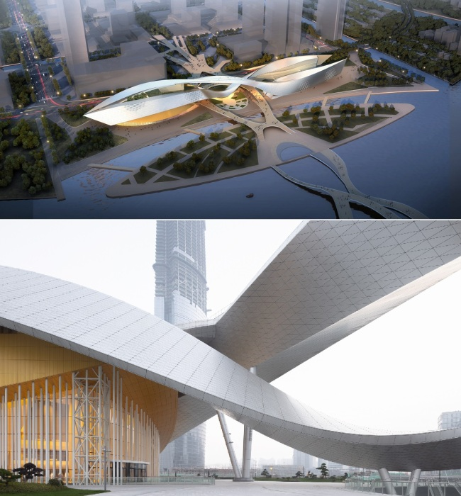
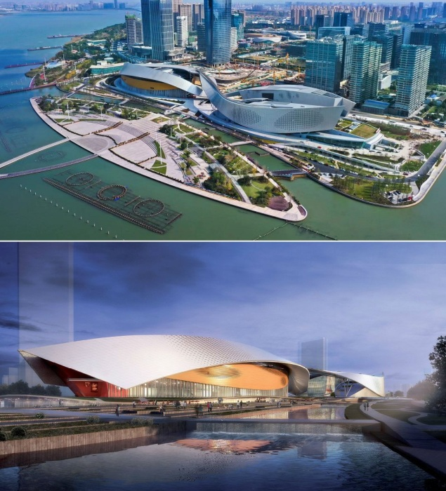

# China has a cultural center "wrapped" in metal tape

- French architect and Pritzker Prize winner Christian de Portzamparc has recently completed another project, the Suzhou Bay Cultural Center. 

The new building, erected on the waterfront of China's Lake Tai, is wrapped in an impressive metal ribbon that curves and turns in the air, reminiscent of the trajectory of a roller coaster. With such a spectacular addition to a complex of four integrated buildings, it was possible to create "a new landscape, connecting water, sky and city in a game of iridescent reflections of the 500-meter ribbon."

Less than 10 years ago there was a deserted plain on the shores of Lake Tai, and now futuristic skyscrapers resembling the world-famous high-rises of Manhattan. The master plan for the development of Taihu's new business district also called for the construction of a grandiose Cultural Center, consisting of several buildings at once. As conceived by the authorities, this particular facility should connect the business part of the vibrant district with the natural area and public space, while highlighting the traditional culture of the region.

The Pritzker Prize laureate, who is famous for his outstanding work, has managed to harmoniously integrate the futuristic object into the intersection of the city's pedestrian square with the picturesque promenade of one of China's largest lakes, fulfilling the wishes of his clients. He managed to utilize an area of over 220,000 square meters, linking several objects together through a ribbon roof supported by giant V-shaped columns, pedestrian areas, and the waterfront.

Structural features: Suzhou Bay Grand Theater consists of two "wings": on one side there is a theater (1,600 seats), a concert hall (600 seats), exhibition areas (24,000 square meters), music halls and a 360-degree cinema; on the other side there are historical and city museums, a conference center, educational platforms, boutiques, cafes, restaurants and lounge areas. Christian de Portzamparc connected the two parts by installing an intertwining arch in the very center, which is clearly visible from afar. But the space inside the complex is designed to emphasize the duality and balance between the two beginnings - yin and yang.

